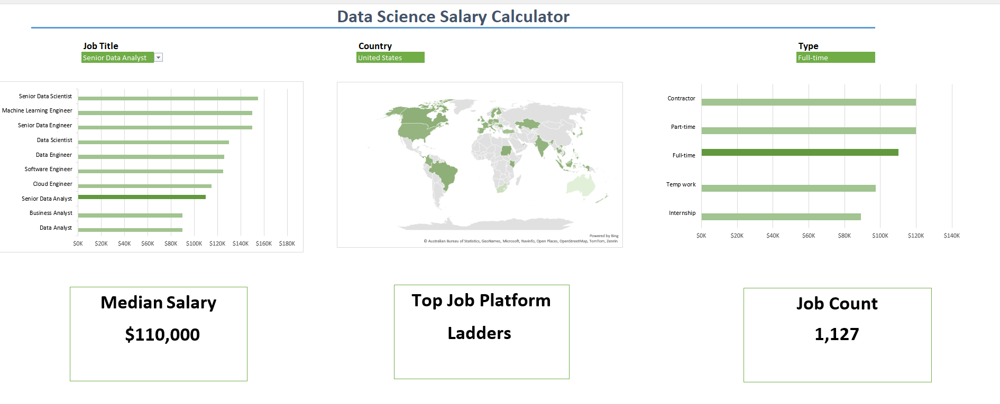

# 📊 Data Jobs Analysis Projects – Excel

Welcome to my Excel learning journey!  
This repository contains two projects analyzing the **Data Jobs Market**, with dashboards and insights built using **Excel tools like Power Query, Power Pivot, DAX, and advanced charting**.  

Both projects use a real-world 2023 dataset of job postings, including job titles, salaries, locations, and required skills.  

---

## 📌 Project 1 – Data Jobs Salary Dashboard  

This dashboard was designed to help job seekers explore **salary patterns** across job roles and locations.  
It provides an interactive way to compare salaries, countries, and job types in the data industry.  

### 🔑 Key Features:
- Salaries by job title (bar chart)  
- Global salary distribution (map chart)  
- Filtered median salary (KPI card)  
- Job schedule type summary  
- Interactive dropdown filters  

👉 [View full Project 1 details (README)](/Project1-%20Salary%20Dashboard/README.md)

---

## 📌 Project 2 – Data Jobs Skills & Salary Analysis  

Building on Project 1, this project dives deeper into the **relationship between skills, salaries, and job locations**.  
It explores which skills drive higher salaries and how pay differs across the US and globally.  

### 🔑 Key Features:
- Median salary analysis (Overall, US, Non-US)  
- Skills vs Salary scatter plot  
- Top 10 skills by salary & demand (combo chart)  
- Data Model with Power Pivot  

👉 [View full Project 2 details (README)](/Project2-Analysis/README.md)

---

## ✅ Conclusion  

These projects strengthened my ability to use **Excel for real-world data analysis**, including:  
- Power Query for cleaning & transformation  
- Power Pivot & DAX for modeling & calculations  
- Advanced visuals for insights  
