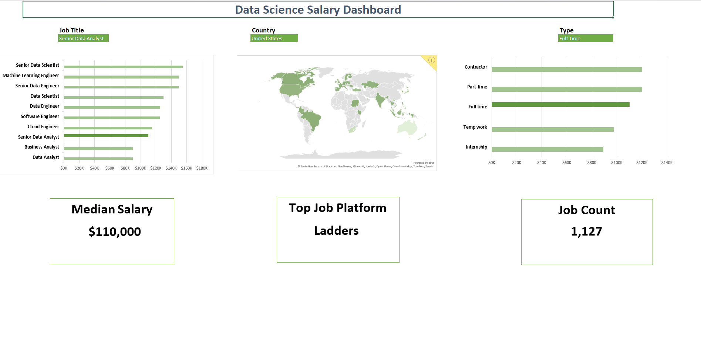
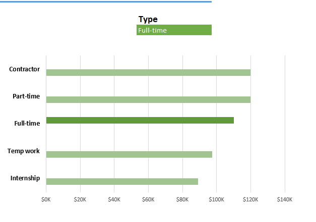

# 📊 **Data Jobs Salary Dashboard**

## 🧭 **Overview**

This dashboard was designed to help job seekers explore salary patterns across various data roles and locations. It offers a visual, interactive experience for understanding how roles, regions, and work types impact compensation in the data industry.

The dataset is part of a hands-on Excel project, based on real-world job listings from 2023, with key data points including:

- 👨‍💼 Job Titles  
- 💰 Salaries  
- 🌍 Locations  
- 🛠️ Skills Required

> ✅ The dashboard helps you make **better career decisions** by comparing salaries across multiple job titles and geographies.

---

## 🛠️ **Excel Features & Skills Used**

This project incorporates core Excel features for dynamic analysis and interactive visuals:

- 📉 **Charts & Graphs**
- 🧠 **Functions** like `MEDIAN`, `FILTER`, `SEARCH`, and `IF`
- ✅ **Data Validation Dropdowns**
- 📋 **Dynamic Tables & Clean Filters**

---

## 📊 **Dashboard Elements**

### 1. 📌 **Salaries by Job Title – Horizontal Bar Chart**

- **Purpose**: Visual comparison of median salaries across roles  
- **Excel Feature**: Horizontal bar chart for readability  
- **Design Highlight**: Sorted job titles by salary (high to low)  
- **Insight**: Senior and engineering positions tend to offer the highest pay  

---

### 2. 🌍 **Country-wise Salary Distribution – Map Chart**

- **Purpose**: View how salaries vary globally  
- **Excel Feature**: Map chart with color-coded salary levels  
- **Design Highlight**: Immediate visual cue for high and low salary regions  
- **Insight**: Shows regional disparities in compensation  

---

### 3. 📄 **Filtered Median Salary – KPI Card**

- **Purpose**: Shows the **filtered median salary** based on selected Job Title, Country, and Job Type  
- **Excel Functions Used**: `MEDIAN`, `IF`, `SEARCH`, `ISNUMBER`  
- **Implementation**: The KPI card dynamically reflects the result of the underlying filtered table, providing a quick and clear summary  
- **Design Highlight**: Displayed using a large, bold font with clean formatting to mimic a modern KPI card  
- **Insight**: Gives users immediate understanding of the salary for the selected role and location  
  

---

### 4. ⏰ **Job Schedule Type Summary**

- **Purpose**: Extract unique and clean job schedule types  
- **Excel Functions Used**: `FILTER`, `SEARCH`, `NOT`  
- **Insight**: Helps users distinguish between full-time, part-time, etc.  

---

### 5. ✅ **Interactive Data Validation**

- **Feature**: Dropdown filters for Job Title, Country, and Type  
- **Purpose**: Prevent user errors and ensure valid selections  
- **Benefit**: Makes dashboard more intuitive and error-proof  

---

These columns serve as the source for dropdown options used in the dashboard filters:

- 📌 Job Title List  
  

- 🕒 Job Type List  
  

---  

## 💡 **Key Takeaways**

This project highlights how Excel can be used to build an insightful and professional dashboard from scratch. Users can easily:

- Identify high-paying roles
- Compare salaries across countries
- Understand how job type affects compensation

By combining **data visualization**, **Excel functions**, and **dynamic filters**, this dashboard brings clarity to career planning in the data domain.

---

